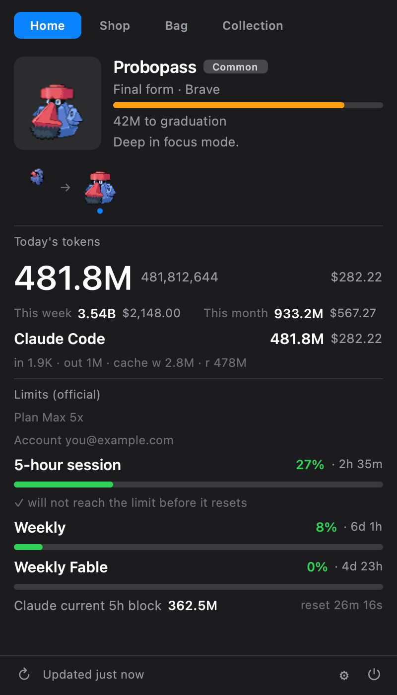
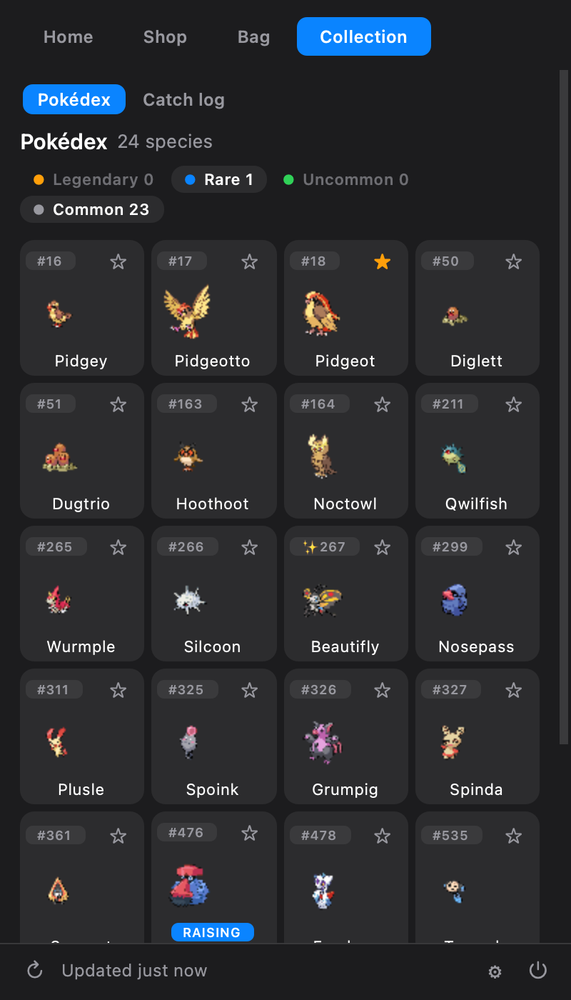
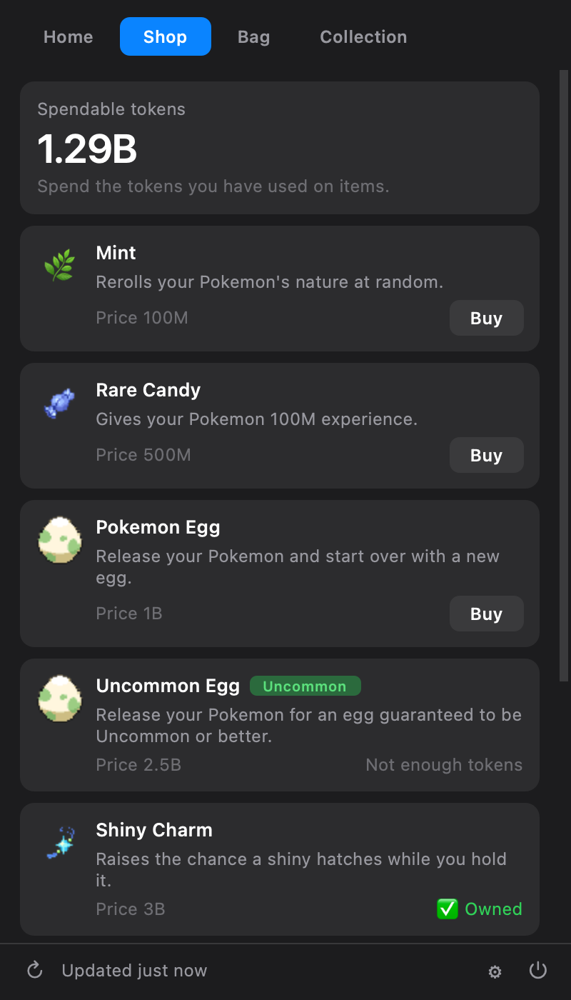
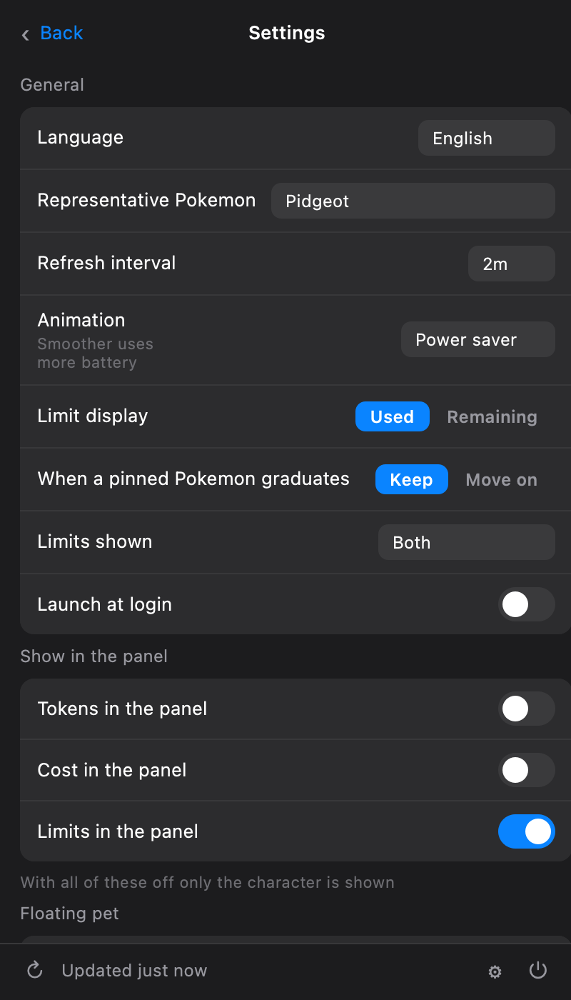

<div align="center">


# PokeTokenBar for Linux &amp; Windows

**Turn the AI coding tokens you're already burning into a Pokémon that grows.**

[](#linux-gnome)
[](#windows)
[](https://www.python.org/)
[](https://github.com/HUHGEON/poketokenbar-linux-windows/actions)
[](LICENSE)

[한국어](README.md) · **English**

An unofficial port of [chattymin](https://github.com/chattymin)'s
[PokeTokenBar](https://github.com/chattymin/PokeTokenBar) to Linux and Windows,
built on top of [rubensanchezrivero](https://github.com/rubensanchezrivero)'s
[poketokenbar-plasma](https://github.com/rubensanchezrivero/poketokenbar-plasma) daemon.

</div>

---

Spend a day in Claude Code and the tokens just disappear. This app turns them into **an egg**.
Keep working and it hatches, evolves along the real evolution chain, and when it reaches a final
form it is preserved forever in your **Pokédex** — then a new egg begins.

Underneath is a usage tracker that is not a joke: tokens and cost for today, the 5-hour and
weekly limits, the countdown to reset, and whether your current burn rate gets you to the cap
first. It reads the local logs of **12 tools** directly. No account, no external CLI, no network
call to produce a single number.

<div align="center">


</div>

## Where this stands

| | |
|---|---|
| Usage daemon (12 providers) | ✅ Done |
| GNOME Shell extension | ✅ **Confirmed working on a real desktop** |
| Qt tray app (Windows, non-GNOME Linux) | ✅ Written |
| Tests | ✅ 1094 Python + 19 JavaScript, CI green |
| Install verified from a clean checkout | ✅ In CI |
| Daemon verified running on real Windows | ✅ On CI's windows-latest runner |
| **UI verified on a real Windows screen** | ❌ **Not yet** ([#7](../../issues/7)) |

The extension was actually run by [@UHeeJoon](https://github.com/UHeeJoon) on Rocky Linux 10 /
GNOME Shell 47–48, and the defects that surfaced there are fixed — rendering that stopped because
a destroyed actor was reused, a closed popup re-decoding sprites every two seconds, sprites
decoding into two copies of the first frame. **None of that was visible in a container.**

The remaining gap is the **Windows tray UI**. The daemon reads real logs and writes a real
`state.json` on a windows-latest runner on every push, and the tray app is constructed and
click-driven on that same runner. But nobody has *seen* the pet and the tray icon on an actual
Windows screen.

## Features

### The game

- 🥚 **Just code.** The tokens you burn across 12 tools incubate an egg.
- 🐣 **Hatching.** Drawn from real gen 1–5 chains on [PokéAPI](https://pokeapi.co/), weighted by
  official capture rate. It gets one of 25 natures, and a **1-in-64 chance of being ✨ shiny**.
- ⚡ **Evolution → 🎓 graduation.** It follows the real evolution tree, and **at a branch it
  prefers a path you haven't caught yet** — so Eevee fills out all eight, not Vaporeon eight times.
- 🛒 **Shop and bag.** Spent tokens are the currency — Rare Candy, mints, Shiny Charm, eggs in
  three tiers. Hitting a limit pays out candy.
- ⭐ **Representative.** Press the star in the Pokédex to pin one to the panel and the desktop
  pet; press again to release. Pin a form and the pin follows it through evolution.
- 🐾 **Desktop pet.** Floats above your windows, drag it anywhere, hover for today's usage.

### The tracker

- 📊 **Official limits.** 5-hour, weekly, and **per-model weekly** (`Weekly Fable`) — that last
  one only exists in the API's `limits[]`, never in the legacy fields. Plan (`Max 5x`) and account,
  reset countdown, the current 5-hour block, and **whether you'll hit the cap before it resets.**
- 🔢 **Used or remaining.** Pick which way to read a limit. Only the display changes — colour,
  gauge, and alert thresholds all still use utilisation.
- 🧮 **Per-model breakdown.** When one session log spans several models, it splits by the model
  that actually answered.
- 📁 **Extra scan folders.** Point any provider at logs outside its default path.

### The app

- 🌐 **7 languages.** Korean, English, Japanese, Spanish, French, Portuguese, German — all 210
  strings, including Pokémon names, all 25 natures, shop items, and hatch/evolve/graduate
  notifications.
- ⬆️ **Update from inside the app.** A new commit shows up in Settings; one button swaps the
  source and restarts. You never have to find the repo again.
- 🔑 **Launch at login**, 🎚 **animation quality** (Saver / Default / Smooth — a real power
  setting, since every frame costs a recomposite), 💾 **save export/import** with undo.

<div align="center">


</div>

## Supported tools

All 12 sources from the original.

| Tool | Read from |
|---|---|
| **Claude Code** | `~/.claude/projects/**.jsonl` |
| **Codex** | `~/.codex/sessions/**.jsonl` |
| **Gemini CLI** | `~/.gemini/tmp/**` |
| **Antigravity** | `~/.gemini/antigravity*/conversations/*.db` |
| **OpenCode** | `~/.local/share/opencode` |
| **Hermes Agent** | `~/.hermes/state.db` |
| **Cursor** | `~/.config/Cursor/User/globalStorage/state.vscdb` |
| **Grok CLI** | `~/.grok/sessions/**/updates.jsonl` |
| **Copilot CLI** | `~/.copilot/session-store.db` |
| **Kiro CLI** | `~/.local/share/kiro-cli`, `~/.kiro`, `~/.kiro/sessions` |
| **Pi Agent** | `~/.pi/agent/sessions` |
| **omp** (oh-my-pi) | `~/.omp/agent/sessions` |

A Claude account also gets the official 5-hour and weekly limits.

Most of these are the same dotfile paths as macOS. Where a location genuinely differs, it was
checked rather than guessed — **Cursor** because Electron documents `app.getPath('userData')`,
not because that's the convention, and **OpenCode** because it uses `~/.local/share/opencode` on
**all three** platforms (`%USERPROFILE%\.local\share\opencode` on Windows). Only **Kiro CLI** is
still unconfirmed, so both candidate locations are searched ([#8](../../issues/8)).

A wrong path is indistinguishable from "you don't use that tool." If you see `(0)` next to a
provider you actually use, that's the symptom — override with `CURSOR_DATA_DIR`,
`KIRO_CLI_HOME`, `KIRO_HOME`, or `OPENCODE_DATA_DIR`.

## Architecture

```
                         ┌──→  state.json      ──→  GNOME Shell extension
poketokend (Python)  ────┤                          Qt tray app (Windows, other Linux)
                         └←──  command spool    ←──  Plasma widget
```

Plain files, not D-Bus. **The daemon knows nothing about any UI** — which is why a second
front-end was possible at all, and why a third was easy. Paths follow the platform (XDG on Linux,
`%APPDATA%` on Windows, Application Support on macOS).

The save is plain JSON and will stay that way. There's no server, no leaderboard, and the currency
is tokens you already spent, so there's nothing to protect; signing it would keep the key on the
same disk, buy minutes, and **cost the ability to repair a corrupted save.** Instead, values that
cannot be true — spent above earned, a species that doesn't exist, a stage off the evolution path
— are caught and corrected at load, and you're told it happened.

## Install

### Linux (GNOME)

Needs GNOME Shell 45+, Python 3.12+, optionally `libnotify` for notifications and
`python-orjson` for faster parsing.

```bash
git clone https://github.com/HUHGEON/poketokenbar-linux-windows.git
cd poketokenbar-linux-windows
./install.sh
systemctl --user enable --now poketokend
gnome-extensions enable poketokenbar@huhgeon.github.io
```

**The shell has to restart before it appears in the list** — `Alt`+`F2` then `r` on Xorg, log out
and back in on Wayland. Enabling the extension *is* launching it; there is no program to start.
The daemon is what produces the numbers, though, so `poketokend` has to be running.

### Linux (other desktops)

On XFCE, Cinnamon, or a tiling compositor there is no panel to extend and no plasmoid to install,
so the Qt tray app — the same one Windows uses — is the only option. `install.sh` falls back to it
automatically when it doesn't recognise the desktop.

```bash
POKETOKENBAR_UI=qt ./install.sh
```

### Windows

Needs Windows 10+ and Python 3.12+.

```powershell
git clone https://github.com/HUHGEON/poketokenbar-linux-windows.git
cd poketokenbar-linux-windows
powershell -ExecutionPolicy Bypass -File packaging\windows\install.ps1
```

There's no panel, so the Pokémon lives in the notification area. Click it for the same tabs. Both
the daemon and the tray app start at login, and you get **Start Menu and desktop shortcuts** so
you never need PowerShell to launch it by hand. Everything installs under your user profile; no
admin rights.

| | Location |
|---|---|
| Config, state, save | `%APPDATA%\poketokenbar\` |
| Cache | `%LOCALAPPDATA%\poketokenbar\` |
| Program | `%LOCALAPPDATA%\PokeTokenBar\` |

Uninstall with `packaging\windows\uninstall.ps1` — it deliberately leaves your save behind.

## What this port fixed

Forking the Plasma port sent this in three directions.

**Ten more providers.** The Plasma port reads Claude Code and Codex only, because its author had
no data to verify the rest against. But the original Swift test suite carries most of those
schemas and sample records, so the parsers came across *with their test cases*. **They're verified
whether or not you use the tool.**

**Defects in the shared core**, found by reading the original line by line.

- Codex reported **zero** for weekly and monthly totals. The daily aggregation had been duplicated
  and the period aggregation never written, so Claude worked and Codex was silently zero.
- Token parsing accepted `int` only, so a corrupted `1e30` became **0 instead of a clamp — erasing
  the day.**
- Flattening the evolution chain **always took the first branch.** Eevee was Vaporeon forever, and
  completing the Pokédex was impossible.
- A disguised Ditto **graduated into the Pokédex as the species it was imitating**, permanently
  recording a catch that never happened.
- There was no egg sprite. PokéAPI's egg is 28×30 on a 96×96 canvas, so uncropped it renders at a
  third the size of everything next to it.
- Natures, item names, and hatch notifications lived outside the catalogue, so switching language
  left **exactly those in English.**

**Features the Plasma port doesn't have:** per-provider extra scan folders, per-model breakdown,
French/Portuguese/German, pinning a representative, animation quality, in-app updates, launch at
login, per-model weekly limits and the 5-hour block, and save undo.

## Development

```bash
python -m pytest -q                # No network, and none of the 12 tools installed
node --test tests/js/*.test.mjs    # Tests that actually execute the extension code
```

**The tests are the specification.** Where a parser rule looks arbitrary, its test records which
case in the original pinned it and what breaks without it.

The Qt front-end tests skip themselves when PySide6 is missing. CI's ubuntu job runs 980; the
Windows job installs PySide6 and runs all 1094.

[docs/TESTING.md](docs/TESTING.md) sets out what is verified and **what isn't** — including the
list of defects those checks actually caught, so "this is worth something" isn't just a claim.

## Credits

- [chattymin/PokeTokenBar](https://github.com/chattymin/PokeTokenBar) — the original macOS app,
  and the source of every parsing rule and balance number here.
- [rubensanchezrivero/poketokenbar-plasma](https://github.com/rubensanchezrivero/poketokenbar-plasma)
  — the Python daemon and the UI-agnostic file protocol this port rides on.
- [@UHeeJoon](https://github.com/UHeeJoon) — verification on a real GNOME desktop, and the defects
  that were invisible in a container.

## License & disclaimer

**MIT** — see [LICENSE](LICENSE). The MIT license covers **this project's own source code only**
and grants no rights to any third-party trademark, artwork, or data reached through the app.

PokeTokenBar for Linux &amp; Windows is an **unofficial, non-commercial fan project**. It is **not
affiliated with, endorsed, sponsored, or approved by Nintendo, Game Freak, Creatures Inc., or The
Pokémon Company.** "Pokémon" and related names, characters, and images are trademarks and
copyrighted works of their respective owners, and this project claims no ownership of or rights in
any Pokémon intellectual property.

- **No Pokémon assets are included in this repository or in any release.** Species data and
  sprites are fetched **at runtime** from the public [PokéAPI](https://pokeapi.co) and cached
  locally on your machine; rights in sprite images served through PokéAPI belong to their
  respective owners.
- The app is provided free of charge for **personal, non-commercial use only.**
- If you are a rights holder with a concern, open an issue or contact the maintainer and it will
  be addressed promptly.

*Provided "as is", without warranty of any kind. This notice is not legal advice.*
