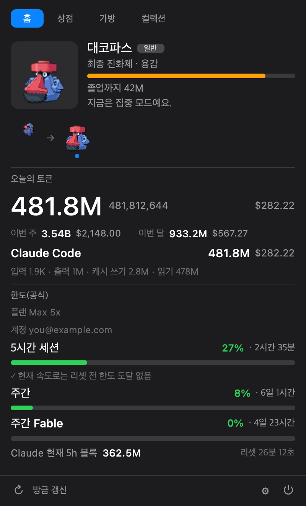
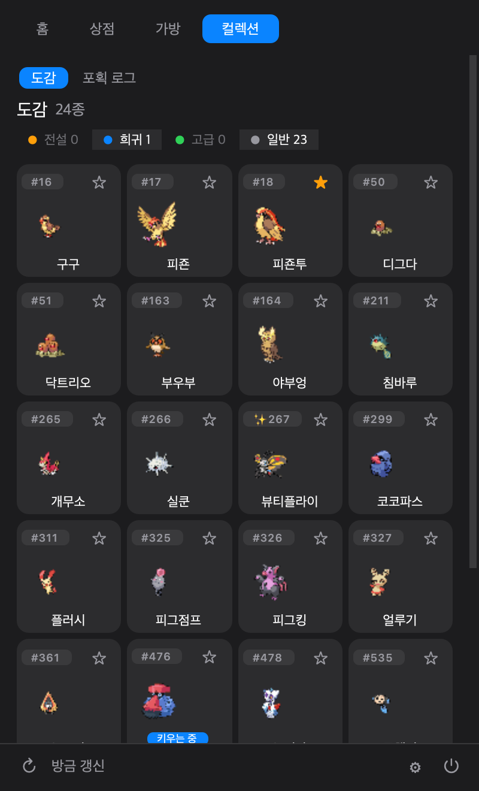
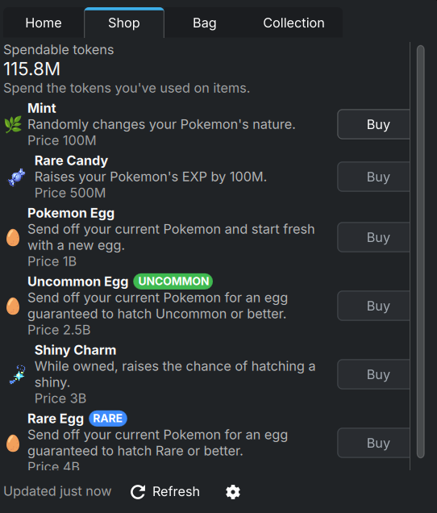
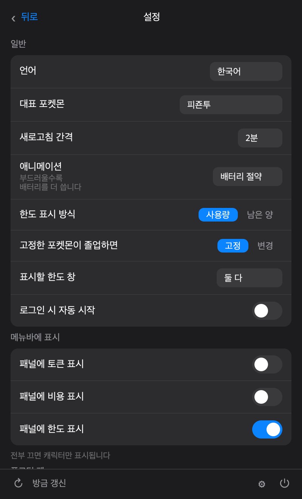

<div align="center">


# PokeTokenBar for Linux &amp; Windows

**이미 태우고 있는 AI 코딩 토큰을, 자라나는 포켓몬으로.**

[](#linux-gnome)
[](#windows)
[](https://www.python.org/)
[](https://github.com/HUHGEON/poketokenbar-linux-windows/actions)
[](LICENSE)

**한국어** · [English](README.en.md)

[chattymin](https://github.com/chattymin) 님의 [PokeTokenBar](https://github.com/chattymin/PokeTokenBar)를 리눅스·윈도우로 옮긴 비공식 포트입니다.
[rubensanchezrivero](https://github.com/rubensanchezrivero) 님의 [poketokenbar-plasma](https://github.com/rubensanchezrivero/poketokenbar-plasma) 데몬 위에 올렸습니다.

</div>

---

Claude Code로 하루를 보내면 토큰이 사라집니다. 이 앱은 그 토큰을 **알 하나**로 바꿔 둡니다.
계속 쓰면 알이 부화하고, 실제 진화 계보를 따라 진화하고, 최종 진화체가 되면 **도감**에
영구 보존되고, 새 알이 시작됩니다.

그 아래에는 장난이 아닌 사용량 트래커가 있습니다 — 오늘 쓴 토큰과 비용, 5시간·주간 한도,
리셋까지 남은 시간, 이 속도면 언제 한도에 닿는지까지. **12개 도구**의 로컬 로그를 직접
읽습니다. 계정도, 외부 CLI도, 숫자를 위한 네트워크도 필요 없습니다.

<div align="center">


</div>

## 지금 상태

| | |
|---|---|
| 사용량 데몬 (프로바이더 12개) | ✅ 완료 |
| GNOME Shell 확장 | ✅ **실제 데스크탑에서 동작 확인** |
| Qt 트레이 앱 (Windows·그 외 리눅스) | ✅ 작성 완료 |
| 테스트 | ✅ Python 1094개 + JavaScript 19개, CI 초록 |
| 클린 체크아웃에서 설치 검증 | ✅ CI에서 |
| 실제 Windows에서 데몬 동작 검증 | ✅ CI의 windows-latest 러너에서 |
| **실제 Windows 화면에서 UI 검증** | ✅ **Windows 10에서 확인** ([#7](../../issues/7)) |

확장은 [@UHeeJoon](https://github.com/UHeeJoon) 님이 Rocky Linux 10 / GNOME Shell 47–48에서
실제로 돌려봤고, 거기서 나온 결함들이 고쳐졌습니다 — 파괴된 액터를 재사용해 렌더링이 멈추던
것, 닫힌 팝업이 2초마다 스프라이트를 재디코드하던 것, 스프라이트가 첫 프레임 두 장으로만
디코드되던 것. **컨테이너에서는 어느 것도 볼 수 없었던 종류입니다.**

마지막까지 남아 있던 빈칸은 **Windows 트레이 UI**였습니다. 데몬은 매 푸시마다
windows-latest 러너에서 실제 로그를 읽어 실제 `state.json`을 쓰고, 트레이 앱은 같은 러너에서
구성·클릭 경로까지 실행됩니다 — 하지만 그 결과를 화면으로 본 사람은 없었습니다. 이제
**Windows 10에서 확인됐습니다**: 클릭해도 펫이 사라지지 않고, 트레이 아이콘이 실제로
움직이고, 팝업 네 탭이 모두 제대로 그려집니다.

## 기능

### 게임

- 🥚 **평소처럼 코딩하세요.** 12개 도구에서 태우는 토큰이 알을 품습니다.
- 🐣 **부화.** [PokéAPI](https://pokeapi.co/)의 1~5세대 계보에서 공식 capture rate 가중으로
  태어납니다. 25종 성격 중 하나가 정해지고, **1/64로 ✨ 이로치**가 나옵니다.
- ⚡ **진화 → 🎓 졸업.** 실제 진화 트리를 따라 자랍니다. **분기가 있으면 아직 안 잡은
  갈래를 먼저** 뽑기 때문에, 이브이는 여덟 갈래를 골고루 채워 갑니다.
- 🛒 **상점과 가방.** 쓴 토큰이 곧 재화 — 이상한 사탕, 민트, 이로치 부적, 3등급의 알.
  한도를 채우면 사탕이 지급됩니다.
- ⭐ **대표 포켓몬.** 도감의 별을 누르면 패널과 데스크탑 펫에 고정하고, 다시 누르면 풉니다.
  고정한 형태가 진화하면 고정도 따라 올라갑니다.
- 🐾 **데스크탑 펫.** 창 위에 떠 있고, 드래그로 옮기고, 호버하면 오늘 사용량이 뜹니다.

### 트래커

- 📊 **공식 한도.** 5시간·주간, 그리고 **모델별 주간**(`주간 Fable`)까지 — 마지막 것은 API의
  `limits[]`에만 오고 레거시 필드에는 없습니다. 플랜(`Max 5x`)·계정, 리셋 카운트다운,
  현재 5시간 블록, 그리고 **리셋 전에 한도에 닿을지** 여부.
- 🔢 **사용량 / 남은 양.** 한도를 어느 쪽으로 볼지 고릅니다. 표시만 바뀌고 색·게이지·알림
  판정은 사용률을 그대로 씁니다.
- 🧮 **모델별 내역.** 세션 로그 하나에 모델이 여럿이면 실제 답한 모델 기준으로 나눕니다.
- 📁 **추가 스캔 폴더.** 기본 경로 밖의 로그를 프로바이더별로 지정.

### 앱

- 🌐 **7개 언어.** 한국어·영어·일본어·스페인어·프랑스어·포르투갈어·독일어 — 포켓몬 이름,
  25종 성격, 상점 아이템, 부화·진화·졸업 알림까지 210개 문자열 전부.
- ⬆️ **앱 안에서 업데이트.** 새 커밋이 올라오면 설정에 뜨고, 버튼 한 번으로 소스를 교체하고
  재시작합니다. 저장소를 다시 찾을 필요가 없습니다.
- 🔑 **로그인 시 자동 시작**, 🎚 **애니메이션 품질**(절약/기본/부드럽게 — 프레임 하나가
  재합성 비용이라 실제 전력 설정입니다), 💾 **세이브 내보내기·불러오기**(되돌리기 포함).

<div align="center">


</div>

## 지원 도구

원본의 12개 소스를 전부 읽습니다.

| 도구 | 읽는 위치 |
|---|---|
| **Claude Code** | `~/.claude/projects/**.jsonl` |
| **Codex** | `~/.codex/sessions/**.jsonl` |
| **Gemini CLI** | `~/.gemini/tmp/**` |
| **Antigravity** | `~/.gemini/antigravity*/conversations/*.db` |
| **OpenCode** | `~/.local/share/opencode` |
| **Hermes Agent** | `~/.hermes/state.db` |
| **Cursor** | `~/.config/Cursor/User/globalStorage/state.vscdb` |
| **Grok CLI** | `~/.grok/sessions/**/updates.jsonl` |
| **Copilot CLI** | `~/.copilot/session-store.db` |
| **Kiro CLI** | `~/.local/share/kiro-cli`, `~/.kiro`, `~/.kiro/sessions` |
| **Pi Agent** | `~/.pi/agent/sessions` |
| **omp** (oh-my-pi) | `~/.omp/agent/sessions` |

Claude 계정은 공식 5시간·주간 한도까지 읽습니다.

대부분은 macOS와 같은 dotfile 경로입니다. 위치가 실제로 다른 것들은 근거를 하나씩
확인했습니다 — **Cursor**는 관례가 아니라 Electron이 `app.getPath('userData')`로 문서화한
것이고, **OpenCode**는 세 플랫폼 **모두** `~/.local/share/opencode`를 씁니다(윈도우는
`%USERPROFILE%\.local\share\opencode`). **Kiro CLI**만 아직 확실하지 않아 두 곳을 다
뒤집니다 ([#8](../../issues/8)).

경로가 틀리면 "사용 안 함"과 구별이 안 됩니다. 설정 화면에서 쓰는 프로바이더 옆에 `(0)`이
보이면 그 증상이고, `CURSOR_DATA_DIR`·`KIRO_CLI_HOME`·`KIRO_HOME`·`OPENCODE_DATA_DIR`로
덮어쓸 수 있습니다.

## 구조

```
                         ┌──→  state.json       ──→  GNOME Shell 확장
poketokend (Python)  ────┤                           Qt 트레이 앱 (Windows·기타 리눅스)
                         └←──  커맨드 스풀        ←──  Plasma 위젯
```

D-Bus가 아니라 그냥 파일입니다. **데몬은 UI를 전혀 모릅니다** — 애초에 두 번째 프론트엔드가
가능했던 이유이고, 세 번째가 쉬웠던 이유입니다. 경로는 플랫폼을 따릅니다(리눅스 XDG,
Windows `%APPDATA%`, macOS Application Support).

세이브는 평문 JSON이고 앞으로도 그렇습니다. 서버도 랭킹도 없고 화폐는 이미 태운 토큰이라
막을 대상이 없으며, 서명을 붙여도 키가 같은 디스크에 있어 몇 분 늦출 뿐이면서 **손상된
세이브를 복구할 능력을 잃습니다.** 대신 참일 수 없는 값 — 누적보다 큰 지출, 존재하지 않는
종, 진화 경로 밖의 단계 — 은 로드할 때 잡아 고치고 그 사실을 알려줍니다.

## 설치

### Linux (GNOME)

준비물: GNOME Shell 45+, Python 3.12+, 알림용 `libnotify`(선택), 파싱 가속용
`python-orjson`(선택).

```bash
git clone https://github.com/HUHGEON/poketokenbar-linux-windows.git
cd poketokenbar-linux-windows
./install.sh
systemctl --user enable --now poketokend
gnome-extensions enable poketokenbar@huhgeon.github.io
```

**셸을 다시 띄워야 목록에 나타납니다** — Xorg는 `Alt`+`F2` → `r`, Wayland는 로그아웃 후 재로그인.
확장을 켜는 것 자체가 실행이고 따로 띄울 프로그램은 없습니다. 다만 숫자를 만드는 건
데몬이라 `poketokend`가 돌고 있어야 합니다.

### Linux (그 외 데스크탑)

XFCE·Cinnamon·타일링 컴포지터처럼 확장할 패널도 plasmoid도 없는 환경에서는 Windows와 같은
Qt 트레이 앱이 유일한 선택지입니다. `install.sh`가 데스크탑을 못 알아보면 자동으로 이걸
깝니다.

```bash
POKETOKENBAR_UI=qt ./install.sh
```

### Windows

준비물: Windows 10+, Python 3.12+.

```powershell
git clone https://github.com/HUHGEON/poketokenbar-linux-windows.git
cd poketokenbar-linux-windows
powershell -ExecutionPolicy Bypass -File packaging\windows\install.ps1
```

패널이 없으니 알림 영역에 포켓몬이 삽니다. 클릭하면 같은 탭이 열리고, 데몬과 트레이 앱
둘 다 로그인 시 자동 시작합니다. **시작 메뉴와 바탕화면 바로가기**도 만들어지니 직접 켤 때
PowerShell을 열 필요는 없습니다. 전부 사용자 프로필 안에만 설치되고 관리자 권한이
필요 없습니다.

| | 위치 |
|---|---|
| 설정·상태·세이브 | `%APPDATA%\poketokenbar\` |
| 캐시 | `%LOCALAPPDATA%\poketokenbar\` |
| 프로그램 | `%LOCALAPPDATA%\PokeTokenBar\` |

제거는 `packaging\windows\uninstall.ps1` — 세이브는 일부러 남겨둡니다.

## 이 포트가 고친 것

Plasma 포트를 포크해서 세 방향으로 갈라졌습니다.

**프로바이더 10개 추가.** Plasma 포트는 Claude Code와 Codex만 읽습니다 — 작성자가 나머지는
검증할 데이터가 없었기 때문입니다. 그런데 원본 Swift 테스트 스위트가 대부분의 스키마와 샘플
레코드를 들고 있어서, 파서를 테스트 케이스와 함께 옮겼습니다. **그 도구를 쓰지 않아도
검증됩니다.**

**공용 코어의 결함들.** 원본과 한 줄씩 대조하면서 나왔습니다.

- Codex가 주·월 합계를 **0으로 보고**했습니다. 일별 집계를 복제해 놓고 기간 집계는 아예
  만들지 않아서, Claude만 되고 Codex는 조용히 0이었습니다.
- 토큰 파싱이 `int`만 받아서, 손상된 `1e30`이 클램프가 아니라 **0이 되어 하루치를
  지웠습니다.**
- 진화 계보를 평탄화할 때 **분기에서 항상 첫 갈래만** 골랐습니다. 이브이는 영원히
  샤미드였고, 도감을 채우는 게 불가능했습니다.
- 위장한 메타몽이 **가장한 종 그대로 도감에 졸업**했습니다. 잡은 적 없는 개체가 영구히
  남습니다.
- 알 스프라이트가 없었습니다. PokéAPI의 알은 96×96 캔버스에 28×30이라, 자르지 않으면 옆
  스프라이트의 1/3 크기로 보입니다.
- 성격·아이템 이름·부화 알림이 카탈로그 밖에 있어서 언어를 바꿔도 **그것들만 영어**였습니다.

**Plasma 포트에 없던 기능:** 프로바이더별 추가 스캔 폴더, 모델별 내역, 프랑스어·포르투갈어·
독일어, 대표 포켓몬 고정, 애니메이션 품질, 앱 내 업데이트, 로그인 시 자동 시작, 모델별 주간
한도와 5시간 블록, 세이브 되돌리기.

## 개발

```bash
python -m pytest -q                # 네트워크 없음, 12개 도구 하나도 설치 안 해도 됨
node --test tests/js/*.test.mjs    # 확장 코드를 실제로 실행하는 테스트
```

**테스트가 곧 명세입니다.** 파서 규칙이 임의로 보이는 곳은, 그 테스트가 어떤 원본 케이스가
그것을 고정했고 없으면 무엇이 깨지는지 적어두었습니다.

Qt 프론트엔드 테스트는 PySide6가 없으면 스스로 건너뜁니다. CI의 ubuntu 잡이 980개를 돌리고,
Windows 잡이 PySide6까지 깔고 1094개 전부를 돌립니다.

무엇이 검증되고 **무엇이 안 되는지**는 [docs/TESTING.md](docs/TESTING.md)에 정리했습니다 —
그 검사들이 실제로 잡아낸 결함 목록까지 포함해서, "값을 한다"는 주장이 주장으로 끝나지
않게 했습니다.

## 크레딧

- [chattymin/PokeTokenBar](https://github.com/chattymin/PokeTokenBar) — 원본 macOS 앱이자
  여기 있는 모든 파싱 규칙과 밸런스 수치의 출처.
- [rubensanchezrivero/poketokenbar-plasma](https://github.com/rubensanchezrivero/poketokenbar-plasma)
  — Python 데몬과, 이 포트가 올라탄 UI 비종속 파일 프로토콜.
- [@UHeeJoon](https://github.com/UHeeJoon) — 실제 GNOME 데스크탑에서의 검증과, 컨테이너에서는
  보이지 않던 결함들.

## 라이선스 & 면책

**MIT** — [LICENSE](LICENSE) 참고. MIT는 이 프로젝트의 **자체 소스 코드에만** 적용되며, 앱을
통해 접근하는 제3자의 상표·아트워크·데이터에 대한 권리는 부여하지 않습니다.

PokeTokenBar for Linux &amp; Windows는 **비공식·비상업 팬 프로젝트**입니다. **Nintendo,
Game Freak, Creatures Inc., The Pokémon Company와 제휴·보증·후원·승인 관계가 없습니다.**
"포켓몬(Pokémon)"과 관련 명칭·캐릭터·이미지는 각 권리자의 상표 및 저작물이며, 본 프로젝트는
어떤 포켓몬 지식재산에 대해서도 소유권이나 권리를 주장하지 않습니다.

- **이 저장소와 모든 릴리스에는 포켓몬 에셋이 포함되지 않습니다.** 종 데이터와 스프라이트는
  공개 [PokéAPI](https://pokeapi.co)에서 **런타임에** 받아 사용자 기기에 로컬 캐시되며,
  PokéAPI를 통해 제공되는 스프라이트 이미지의 권리는 각 권리자에게 있습니다.
- 본 앱은 **개인적·비상업적 용도로만** 무료 제공됩니다.
- 권리자께서 우려가 있으시면 이슈를 열거나 메인테이너에게 연락 주시면 신속히 대응하겠습니다.

*본 프로젝트는 어떠한 보증도 없이 "있는 그대로" 제공됩니다. 본 고지는 법률 자문이 아닙니다.*
